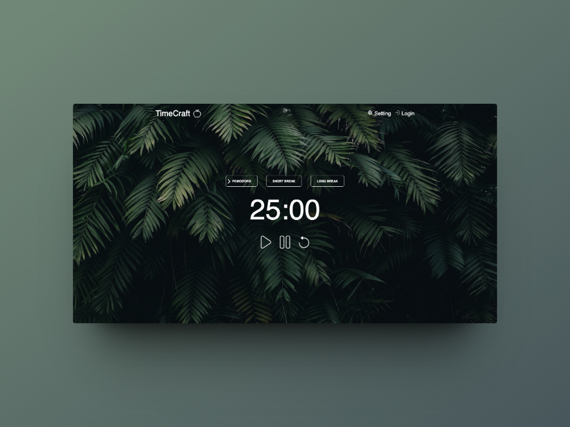

# Pomodoro Timer

The Pomodoro Timer is a simple and effective application based on the Pomodoro technique for time management. This technique, developed by Francesco Cirillo in the 1980s, involves breaking work into intense 25-minute intervals, followed by a short 5-minute break. After four work sessions, a longer break of 15 to 30 minutes is granted.

## Features:
- **Pomodoro Timer:** Easily set up the Pomodoro timer for 25-minute work sessions.
- **Notifications:** Receive audible or visual notifications at the end of each work session or break.
- **Customization:** Adjust work and break durations according to your preferences.
- **History:** View the history of your work sessions to track your productivity over time.
- **Focus Mode:** Enable Focus Mode to block distractions during work periods.

## How to Use:
1. **Set Duration:** Define the duration of your work session and breaks in the settings.
2. **Start the Timer:** Press "Start" to initiate your first work session.
3. **Work Intensely:** Focus on your task for the defined duration.
4. **Take a Break:** Enjoy the break to relax, hydrate, or stretch.
5. **Repeat:** Repeat the process for each work session, taking regular breaks.

## Contribution:
Contributions are welcome! If you'd like to improve the Pomodoro Timer or report an issue, please submit an issue or pull request.

